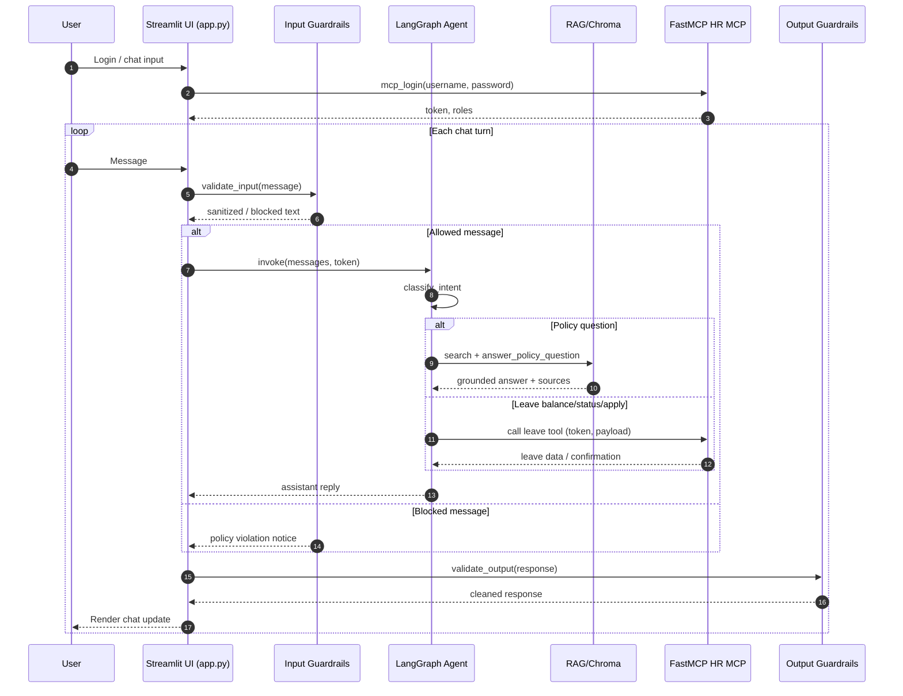

# HR Assistant v2

An authenticated HR copilot that lets employees chat about policies, check their leave balance, view past requests, and even apply for new leave directly inside Streamlit. Administrators can upload new policies, rebuild the retrieval index, and manage the document library.


## Architecture Overview

- **Presentation** – `app.py` renders Streamlit pages for login, chat, policy upload, and library management.
- **Guardrails** – `guardrails_local.py` runs pre/post validation for every message, blocking toxic or injected input and sanitizing replies.
- **Orchestration** – `agent.py` (LangGraph) classifies intent via GPT‑4o mini and routes to policy RAG, leave lookups, or the conversational leave-apply workflow.
- **Knowledge** – `rag.py` ingests policies (PDF/TXT/MD/HTML), builds Chroma embeddings with OpenAI, and serves grounded answers.
- **System of record** – `mcp_client.py` talks to the FastMCP HR backend for login, leave balance, history, and submit actions.


## Sequence Diagram




## High-Level Design

| Layer | Responsibilities | Key Files / Services |
| --- | --- | --- |
| Presentation | Streamlit pages, login form, role-aware tabs, session state, download/delete actions | `app.py` |
| Guardrails | Input filtering (toxicity, injection, size), output cleanup | `guardrails_local.py` |
| Orchestration | Intent classification, policy RAG handler, leave balance/status/apply handlers | `agent.py`, LangGraph, `langchain_openai` |
| Knowledge Store | Policy loaders, text splitting, embedding build/rebuild, Chroma persistence | `rag.py`, `data/policies`, `data/policy_index` |
| External APIs | FastMCP authentication + leave tools, OpenAI models/embeddings | `mcp_client.py`, OpenAI API |
| Configuration & Secrets | Directory paths, `.env` loading, MCP endpoint config | `config.py`, `.env` |


## Repository layout

```
├── app.py                  # Streamlit entry point
├── agent.py                # LangGraph agent + intent handlers
├── guardrails_local.py     # Chat guardrails
├── rag.py                  # Policy ingestion + retrieval helpers
├── mcp_client.py           # FastMCP integration
├── config.py               # Directory/env configuration
├── data/
│   ├── policies/           # Drop uploaded HR docs here
│   └── policy_index/       # Chroma vector store (auto-generated)
├── pyproject.toml          # Project metadata + dependencies
├── uv.lock                 # Locked dependency graph
└── test_*.py               # Example tests for MCP flows
```


## Prerequisites
- Python 3.12+
- [uv](https://docs.astral.sh/uv/) (package/dependency manager)
- OpenAI API key (set `OPENAI_API_KEY` in `.env`)
- Access to the FastMCP HR backend (default URL: `https://employee.fastmcp.app/mcp`)


## Setup (uv)

1. **Clone and enter the repo**
   ```bash
   git clone <repo-url> hr_assistant_v2
   cd hr_assistant_v2
   ```
2. **Install dependencies with uv**  
   (This reads `pyproject.toml` + `uv.lock` and creates a virtual env automatically.)
   ```bash
   uv sync
   ```
3. **Configure environment variables**  
   Create a `.env` file in the project root (auto-loaded via `python-dotenv`):
   ```bash
   OPENAI_API_KEY=sk-...
   POLICY_DIR=data/policies
   POLICY_INDEX_DIR=data/policy_index
   ```
4. **(Optional) Add new dependencies**  
   ```bash
   uv add <package-name>
   ```
   After adding, re-run `uv sync` on other machines to reproduce the lock file.


## Running the assistant

1. **Start Streamlit**
   ```bash
   uv run streamlit run app.py
   ```
2. **Log in** using the credentials provisioned on the FastMCP server. Successful login stores the MCP token in Streamlit session state.
3. **Upload or update policies** from the “Upload Policies” tab (admins only). Supported formats: PDF, TXT, MD, HTML.
4. **Rebuild the vector index** either immediately after uploading (button in the UI) or manually:
   ```bash
   uv run python -c "from rag import build_or_rebuild_vector_store; build_or_rebuild_vector_store()"
   ```
5. **Chat with the assistant**  
   - Policy Q&A uses RAG grounded answers with citations.  
   - Leave balance/status/submit intents call MCP tools using the authenticated token.  
   - Guardrails block unsafe input and scrub output before it is rendered.


## Testing

Run any available tests (e.g., MCP login mocks) with:
```bash
uv run pytest
```


## Operational notes
- The Chroma DB lives under `data/policy_index`; deleting it forces a clean rebuild.
- MCP endpoints are configured in `mcp_client.py`. Update `MCP_SERVER_URL` if your FastMCP deployment lives elsewhere.
- Streamlit session state contains the login token; logging out clears all cached chat history.
- Both embeddings and chat completions use OpenAI models (`text-embedding-3-small`, `gpt-4o-mini`). Ensure the API key has access to these models or adjust the model names in `rag.py` and `agent.py`.
